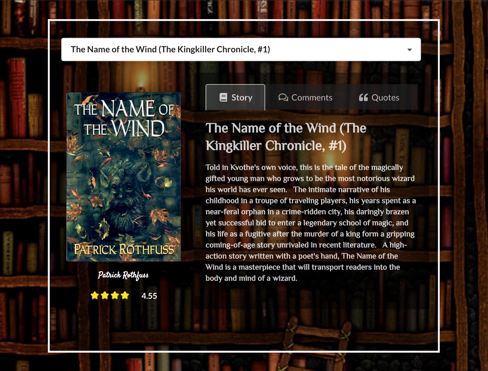
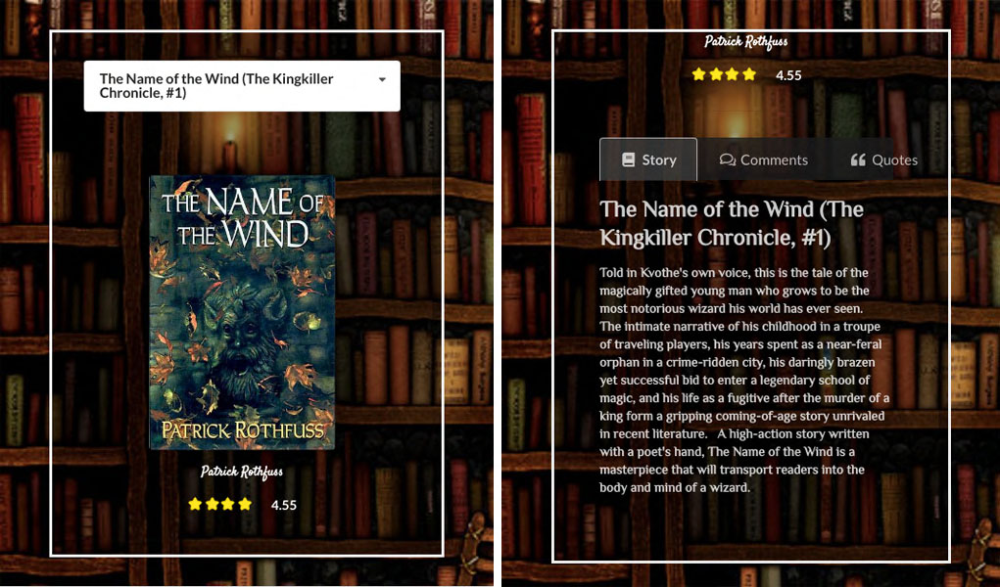

# Eook
Eook is a book quotes storage web application (in progress) build with the following techs (so far):  
  
**Front-end** (client):  
Node.js, React.js, Redux, Semantic UI React  
  
**Back-end** (api):  
TypeScript, Node.js, Express API, PostgreSQL

## Purpose
This is a practice project for me to learn new tech slacks (Redux, TypeScript) and learn to build responsive web app with React.js.  
Books' information are retrieved from [Goodreads API](https://www.goodreads.com/api) and [Open Library API](https://openlibrary.org/developers/api).  

Front-end and Back-end are two individual applications. Installation guides will be provided individually on their own project description. 

## Sample Screen
**Browser view**

**Mobile view**

